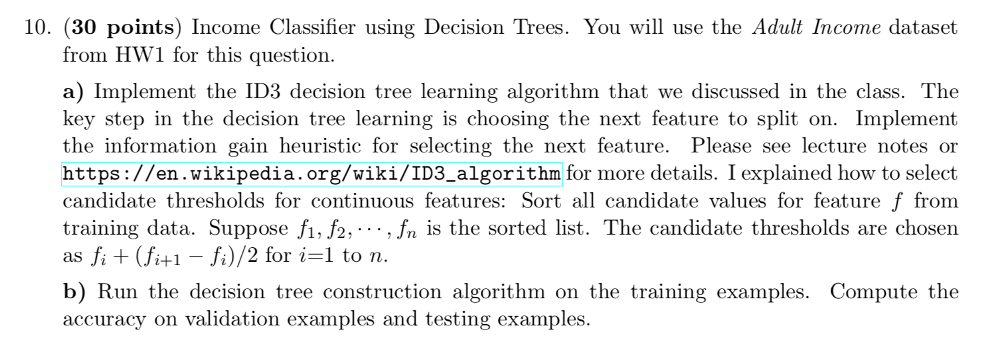
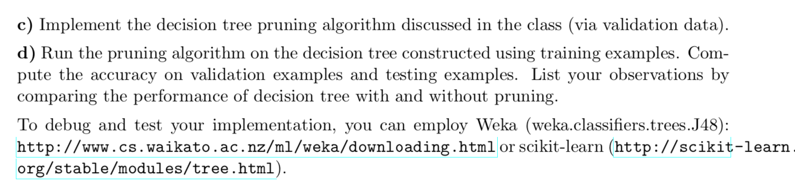

# id3DecisionTree

  
  
**Note:**  

**For categorical data the number of splits are equal to the number of unique values of the attribute**  

**For continuous data if the values are 1,2,3,4 then splits are 1.5, 2.5, 3.5 (This was mentioned in class)**  

OUTPUT: 

=========================  

Training please wait ..... (takes 60 seconds) --- 60.211225509643555 seconds ---  

Training Accuracy: 94.84%  
Dev Accuracy: 76.19%  
Testing Accuracy: 74.78%  
